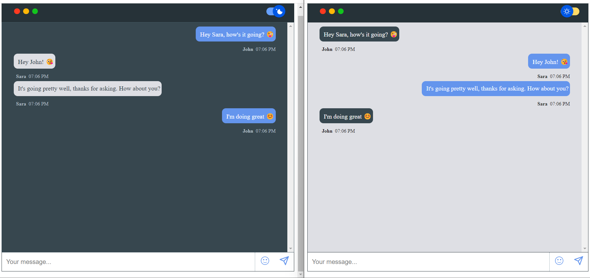

# Getting Started with Chatroom Project

The Chatroom project is a real-time chat platform that allows multiple users to connect to the same room and exchange messages. The chatroom is built using Web Sockets, which enables near-instant communication between connected clients.



## Running the Project

In order to run the Chatroom project, you'll need to follow the steps below:

### Backend

Open a terminal window and navigate to the server directory by running the following command:

```bash
    cd server
```

Install the necessary dependencies by running the following command:

```bash
    npm install
```

Start the server by running the following command:

```bash
    nodemon index.js
```

### Frontend

Open another terminal window and navigate to the front directory by running the following command:

```bash
    cd front
```

Install the necessary dependencies by running the following command:

```bash
    npm install
```

Start the frontend by running the following command:

```bash
    npm start
```

Once the backend and frontend are running, you should be able to access the chatroom in your browser at http://localhost:3000/.
